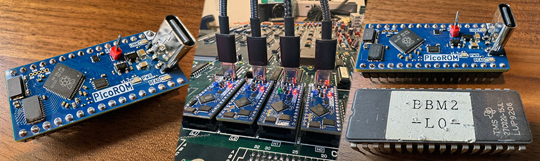
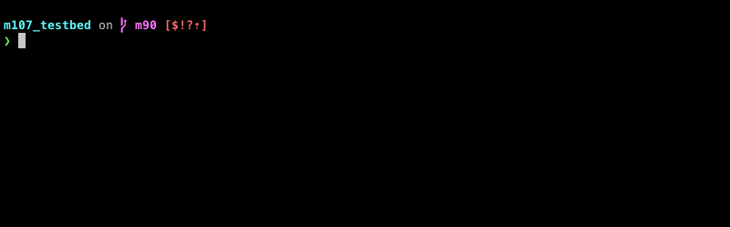
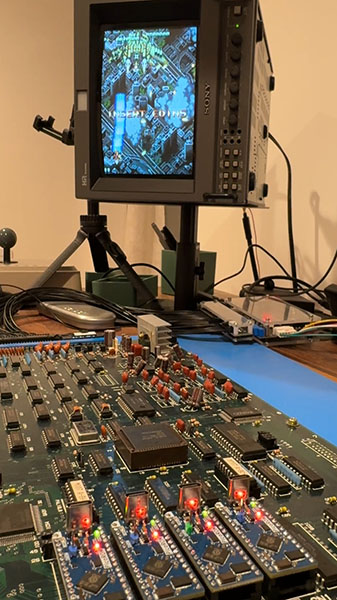
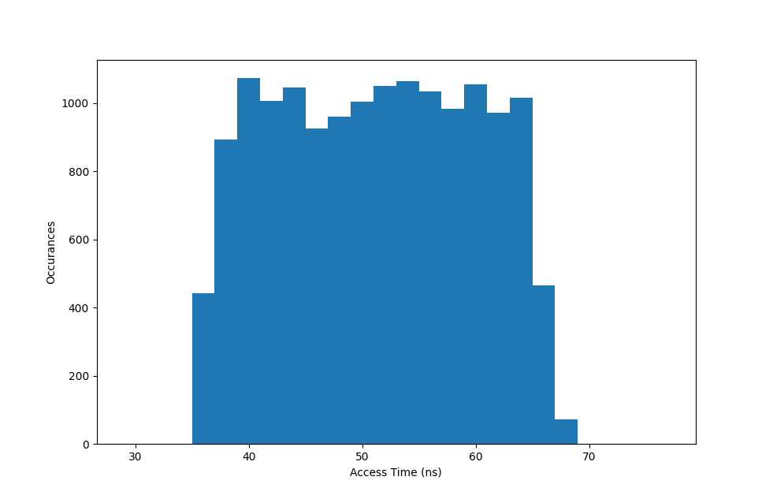
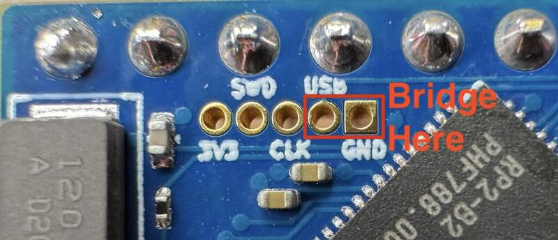

# PicoROM
PicoROM is an 8-bit ROM emulator in a DIP-32 compatible form factor. Its main use case (the reason I made it) is for rapid iteration when experimenting with arcade hardware. The PicoROM can emulate ROMs up to 2MBit (256Kbytes) in size and access times of 70ns. Its size allows it to fit into almost any ROM socket regardless of how crowded the board might be.



Feature Summary
- DIP-32 form factor
- 2MBit (256KByte) storage
- 70ns access time
- USB or board powered
- Reset line

Fully assembled versions available for purchase from [Tindie.](https://www.tindie.com/products/pbretro/picorom/)

## Operation
A PicoROM is controlled by the `picorom` tool on a PC via the USB connection. The `picorom` tool allows you to list PicoROMs attached to the system, rename them, set parameters and (most important of all) upload ROM data.
Each PicoROM device has a name that is used to identify it when running commands. It is not uncommon to have multiple devices connected at once and want to send different data to each one. Arcade boards often have multiple ROMs to both increase the total memory size, to increase the bus width or both. You can get a list of the PicoROMs currently connected using the `picorom list` command:

```console
foo:~ $ picorom list
Available PicoROMs:
  E66138528361BB3  [/dev/cu.usbmodem101]
  E661385490CD014  [/dev/cu.usbmodem102]
```

PicoROMs use a unique hardware ID from their flash memory as their default name. I usually name the PicoROMs based on how they are currently being used. An arcade board might have two ROMs for the main CPU, one for the lower 8-bits and one for the upper, so you could name the PicoROMs `cpu_low` and `cpu_high`. You can then target those PicoROMs in your makefiles or other scripts. You can change a PicoROMs name using the `picorom rename` command. 

```console
foo:~ $ picorom rename E66138528361BB3 cpu_low
Renamed 'E66138528361BB3' to 'cpu_low'
```

Most `picorom` commands take the form of `picorom <COMMAND> <NAME> <ARGUMENTS...>` where `<NAME>` is the name of the device you are targetting. The single most important and useful `picorom` command is `upload` which uploads a binary image to the PicoROM.

```console
foo:~ $ picorom upload cpu_low cpu_low.bin
Uploading ROM [################################################################] Done.
```

Once the upload is complete (which should only take about a second) the PicoROM will start returning this data for any access requests it receives on its address pins. The uploaded data is stored in RAM on the PicoROM so if the device is powered off the data will be lost. You can also store a copy of the data into flash memory, from there it will be loaded into RAM whenever the device starts up. You can do this by either passing the `-s` parameter to the `upload` command or by running the `commit` command. The commit command will copy whatever is currently in RAM into flash memory.

```console
foo:~ $ picorom upload cpu_low cpu_low.bin -s
Uploading ROM [################################################################] Done.
Storing to Flash - Done.

foo:~ $ picorom commit cpu_low
Storing to Flash - Done.

```

The PicoROM operates in 2Mbit mode by default. So if you upload a smaller image, 1MBit for instance, then that will only occupy half the ROM space and the other half will be undefined. You can instruct the PicoROM to emulate smaller ROM sizes by passing a size parameter to the `upload` command.

```console
foo:~ $ picorom upload cpu_low cpu_low_1mbit.bin 1MBit
Uploading ROM [################################################################] Done.
```

### Reset Control
The PicoROM has an external reset pin that can be used to drive the reset signal of whatever hardware you are working with. The reset pin state is set using the `picorom reset` command. It is a tri-state output so the signal can either be +5V/high (`high`), low/ground (`low`) or high-impedance (`z`). The `reset` command can be used as part of a build script to reset a system when a new ROM image is uploaded.

```make
# picorom makefile target to trigger reset and upload ROM image
picorom: cpu_low.bin cpu_high.bin
    picorom reset cpu_low low
    picorom upload cpu_low cpu_low.bin
    picorom upload cpu_high cpu_high.bin
    picorom reset cpu_low z
```



How you interface with reset hardware on each system is going to differ and it may not be possible to override the systems reset signal in all cases. The reset pin on the PicoROM does not only have to be used for system resets, it can be treated as a generic controllable output.

### Standalone
The PicoROM draws its power from either the USB-C connection or from the 5V VCC input at pin 32. This means that the PicoROM can function like a regular standalone ROM chip without any USB connection. There are is a caveat though. At startup the ROM data needs to be read from flash memory and copied into the static RAM of the RP2040. This process takes approximately 8ms and any ROM accesses will be ignored until it completes. This process itself won't start until the RP2040 itself has powered up and determined that its supply voltage is stable, so there may be additional delays caused by that. Some systems have reset control circuitry that delays full startup of the system until the supply voltage has been stable for a certain amount of time. If this delay is longer than 8ms then a PicoROM will probably function fine.

|  |
|:-:|
| *Air Assault M107 running standalone with four PicoROMs* |

The reset signal can be used to mitigate this problem in some cases. You can specify a reset value that will be asserted while the initial copy is happening by setting the `initial_reset` parameter.

```console
foo:~ $ picorom set cpu_low initial_reset high
initial_reset=high
```

## Performance
The worst case access time in 70ns. That is measured as the time from when an address is asserted on the address bus to the time that the data is available on the data bus. In datasheets for ROMs and EPROMs this is often referred to as "Address to Output Delay." The PicoROM is a synchronous device running an instruction loop there is variablity in the access time depending on where in the loop the software is when an address is asserted.



The delay from the output and chip enable signals being assert to the data bus becoming active is less variable and has been measured to have a worse case of 40ns. This is usually referred to as "Output Enable to Output Delay" in datasheets. The inverse, the delay from output/chip enable deasserted to the data bus going high-impedance, has not been measured but it is assumed to be the same.

## Installation
To use a PicoROM you will need the `picorom` command line application and the PicoROM firmware, both are available as part of a [release](https://github.com/wickerwaka/PicoROM/releases/latest). The `picorom` application is pre-built for Windows, MacOS (ARM and Intel) and Linux (ARMv7 and Intel). In the unlikely case that you platform is not supported you can try building it from source. Copy the correct version of the application into a location that is in your path and rename it to just `picorom` (or `picorom.exe` for Windows users.) The firmware is a `.uf2` file named something like `PicoROM-2MBit-VERSION.uf2`. There are several ways that the firmware file can be loaded onto a PicoROM, but they all involved getting the device into USB boot mode. At the point it will appear as a USB mass storage device and all you need to do is copy the `.uf2` file to it.

If you are upgrading a device that already has at least firmware version 1.7 installed then you can use the `picorom usb-boot` command to reboot it into USB boot mode and then copy the firmware file to it. You can also use the RP2040 `picotool` to reboot and upload the firmware image. I won't cover that here but you can find instructions on the [picotool github page](https://github.com/raspberrypi/picotool).

If your PicoROM has gotten into some kind of broken state you can force it into USB boot mode by bridging the `USB` and `GND` connections on the unsoldered header next the the RP2040 and then powering the device on. It's pretty small and hard to see but a small bit of wire should fit in there and make enough contact.



Once the firmware has been copied over, power-cycle the PicoROM and then run `picorom list` to ensure it is present. You can use `picorom get` to query the current firmware version to ensure the installation or upgrade was successful.


