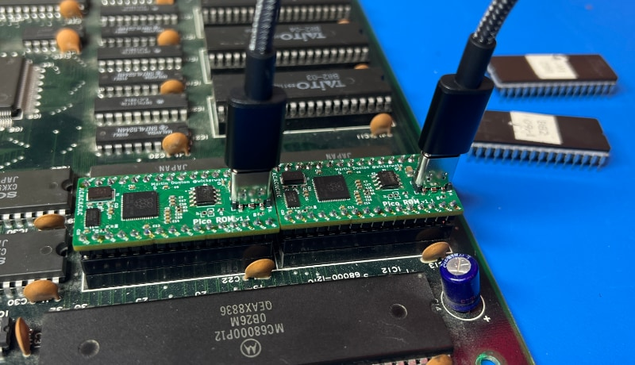
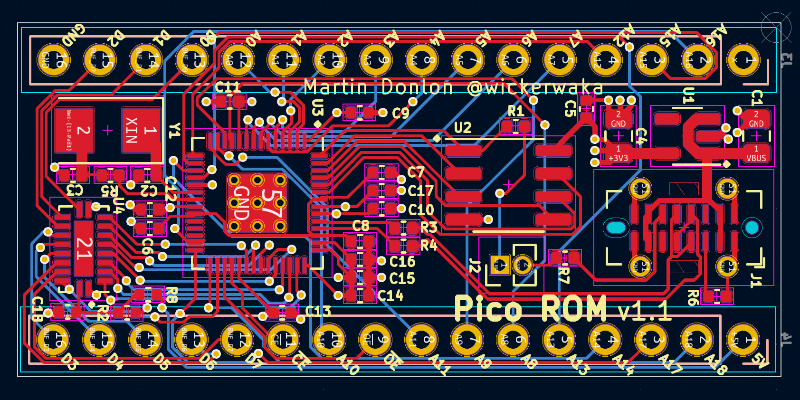

# PicoROM
PicoROM is an 8-bit ROM emulator in a DIP-32 compatible form factor. It's main use case (the reason I made it) is for rapid iteration when experimenting with arcade hardware. The PicoROM can emulate ROMs up to 2MBit (256Kbytes) in size and speeds of 100ns. 

## Hardware
The PicoROM is based around the Raspberry Pi [RP2040](https://www.raspberrypi.com/products/rp2040/) microcontroller. A vertically mounted USB-C connector is used for power and communication with the host PC. The vertical orientation might seem awkward, but it ensures that all the hardware stays within the DIP-32 form factor and won't interfere with any adjacent hardware.

The pinout used is compatible with a 27C020 EPROM, which I believe follows a JEDEC standard and is common to a lot of ROM and RAM ICs.

KiCad project files are located in the `hardware/` directory.

## Firmware
The firmware is written in C/C++ using the [Pico C SDK](https://www.raspberrypi.com/documentation/pico-sdk/). The firmware is responsible for the ROM emulation, managing communication with the host PC and facilitating communication between the host PC and the target device.

The RP2040 has 264KByte of static RAM and 256KBytes of that are used to store the ROM data. The external flash is not fast enough for these purposes. It is used for store the firmware itself, config settings and a copy of the ROM image that gets loaded at startup. The ROM emulation itself is achieved using a combination core1 and the PIO state machines. A small assembly loop running on core1 interprets the address lines, reads the data from memory and presents it on the data pins. Core1 is given high priority bus access, so it can always read and write in a single cycle. The PIO is used to interpret the chip and output enable signals.

The `firmware/` directory contains the firmware source code.

## Host Software
Software on a host PC is used to upload ROM data to the PicoROM. The `picorom` command line tool has the ability to list the PicoROMs currently connected, give them unique names and upload new data to them. It is common for data to be split across multiple ROMs, especially in 16-bit systems. So giving a PicoROM names like `cpu_high` or `sprite1` allows you to have multiple PicoROMs connected at once without any confusion about where you are sending the data.

There is also a Python module called `pypicorom` which provides all the same functionality as the command line tool. It also supports `read` and `write` methods for communicating with the software that is accessing the ROM data.

The host PC software is written in Rust and is in the `host/` directory.

## Two-way communication
I personally find it useful to build test software that supports some kind of command system for doing things on the system I am experimenting with. This allows me to write scripts in a high level language, like python, that can read/write memory, trigger other hardware on the system, etc.

To support this the firmware allows a specified region of ROM memory to be used to both send and receive a byte stream to/from the host PC. The software on the target system can read from a known address to get the latest byte from the host, and it can *read* from one of 256 other addresses to send a byte to the host PC. Through this system about 5Kbytes/sec can be sent and received.

