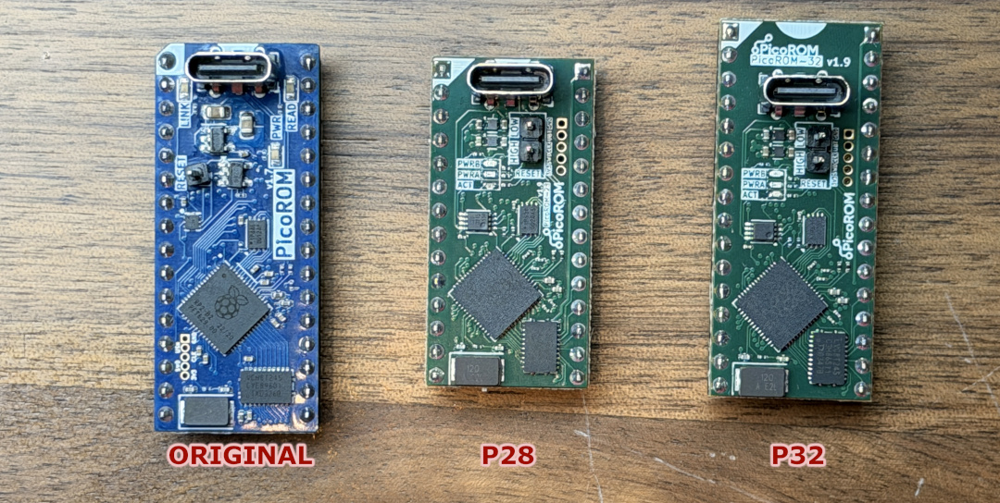

---
PicoROM is an 8-bit ROM emulator in DIP-32 and DIP-28 form factors. Its primary use case is rapid iteration when experimenting with arcade hardware. PicoROM can emulate ROMs up to 2MBit (256KB) with access times of 70ns. Its compact size allows it to fit into almost any ROM socket regardless of how crowded the board might be.


**Features**
- DIP-32 and DIP-28 form factors
- Up to 2MBit (256KB) storage
- 70ns access time
- USB control with integrated firmware updates
- Controllable reset pin

Fully assembled versions are available from [Tindie](https://www.tindie.com/products/pbretro/picorom/).

## Hardware Variants
There are three hardware versions of PicoROM:

- **PicoROM Original (POG)** — Original 32-pin design with a single tri-state reset pin (high, low, or high-impedance). Can be powered by USB or from the host board.
- **PicoROM 28 (P28)** — 28-pin design with dual reset pins (one for high, one for low). Uses split power: the microcontroller is powered by USB or the host board, but external buffers are powered from the 5V input. This reduces power consumption when connected to an unpowered device via USB.
- **PicoROM 32 (P32)** — 32-pin design with all the improvements from P28.

The abbreviated names POG, P28, and P32 identify which firmware image to use for each device.



## Version 2.0
Version 2.0 introduced a custom USB protocol, replacing the emulated USB serial port used in version 1.x. The 2.0+ firmware is not compatible with the 1.x `picorom` tool, and vice versa.

## Operation
PicoROM is controlled via USB using the `picorom` command-line tool. The tool can list connected devices, rename them, set parameters, upload ROM data, and update firmware.

Each PicoROM has a name used to identify it in commands. Multiple devices can be connected simultaneously—arcade boards often use multiple ROMs to increase memory size or bus width. List connected devices with `picorom list`:

```console
foo:~ $ picorom list
Available PicoROMs:
  E66138528361BB3  [/dev/cu.usbmodem101]
  E661385490CD014  [/dev/cu.usbmodem102]
```

By default, PicoROMs use a unique hardware ID from flash memory as their name. You can rename devices based on their function—for example, an arcade board with two CPU ROMs (one for the lower 8 bits, one for the upper) could use `cpu_low` and `cpu_high`. These names can then be referenced in makefiles or scripts.

To identify which physical device corresponds to a name, use `picorom identify <name>` to flash its activity LED.

Rename a device with `picorom rename`:

```console
foo:~ $ picorom rename E66138528361BB3 cpu_low
Renamed 'E66138528361BB3' to 'cpu_low'
```

Most commands follow the pattern `picorom <COMMAND> <NAME> <ARGUMENTS...>` where `<NAME>` identifies the target device. The primary command is `upload`, which transfers a binary image to PicoROM:

```console
foo:~ $ picorom upload cpu_low cpu_low.bin
Uploading ROM [################################################################] Done.
```

After upload, PicoROM immediately serves the data for any address requests. Uploaded data is stored in RAM and lost when power is removed. To persist data across power cycles, save it to flash memory using the `-s` flag during upload or the `commit` command afterward:

```console
foo:~ $ picorom upload cpu_low cpu_low.bin -s
Uploading ROM [################################################################] Done.
Storing to Flash - Done.

foo:~ $ picorom commit cpu_low
Storing to Flash - Done.

```

PicoROM defaults to 2MBit mode. If you upload a smaller image, the remaining address space is undefined. To emulate smaller ROM sizes, specify the size during upload:

```console
foo:~ $ picorom upload cpu_low cpu_low_1mbit.bin 1MBit
Uploading ROM [################################################################] Done.
```

You can also download the current ROM contents from a device:

```console
foo:~ $ picorom download cpu_low backup.bin
Downloading ROM [##############################################################] Done.
```

### Reset Control
PicoROM has an external reset pin for controlling the host hardware's reset signal. The pin is a tri-state output: high (+5V), low (ground), or high-impedance (`z`). Use this in build scripts to reset a system after uploading a new ROM:

```make
# picorom makefile target to trigger reset and upload ROM image
picorom: cpu_low.bin cpu_high.bin
    picorom reset cpu_low low
    picorom upload cpu_low cpu_low.bin
    picorom upload cpu_high cpu_high.bin
    picorom reset cpu_low z
```


How you interface with each system's reset hardware will vary, and it may not always be possible to override the system's reset signal. The reset pin can also serve as a general-purpose controllable output.

### Standalone Operation
PicoROM draws power from either USB-C or the 5V VCC input at pin 32/28, allowing it to function as a standalone ROM without a USB connection.

At startup, ROM data must be copied from flash to RAM, which takes approximately 8ms. ROM accesses are ignored until this completes. Additional delays may occur while the RP2040 waits for stable supply voltage. Systems with reset circuitry that delays startup for longer than 8ms should work reliably.

|  |
|:-:|
| *Air Assault M107 running standalone with four PicoROMs* |

The reset pin can mitigate startup timing issues. Set the `initial_reset` parameter to assert a reset value during the initial flash-to-RAM copy:

```console
foo:~ $ picorom set cpu_low initial_reset high
initial_reset=high
```

## Performance
Worst-case access time is 70ns, measured from address assertion to data availability on the data bus. ROM datasheets typically call this "Address to Output Delay." Since PicoROM runs a synchronous instruction loop, access time varies depending on where in the loop the address is asserted.


The delay from output/chip enable assertion to data bus active (Output Enable to Output Delay) is more consistent, with a worst case of 40ns. The inverse delay (enable deasserted to high-impedance) has not been measured but is assumed to be similar.

## Installation
Download the `picorom` command-line application from the [latest release](https://github.com/wickerwaka/PicoROM/releases/latest). Pre-built binaries are available for Windows (Intel), macOS (ARM and Intel), and Linux (ARMv7 and Intel). 
Download the appropriate file for your system from the selection below, place the binary in your PATH and rename it to `picorom` (or `picorom.exe` on Windows).
* Windows: [Intel 64-bit](https://github.com/wickerwaka/PicoROM/releases/latest/download/picorom-x86_64-pc-windows-msvc.exe)
* MacOS: [ARM 64-bit](https://github.com/wickerwaka/PicoROM/releases/latest/download/picorom-aarch64-apple-darwin), [Intel 64-bit](https://github.com/wickerwaka/PicoROM/releases/latest/download/picorom-x86_64-apple-darwin)
* Linux: [Intel 64-bit](https://github.com/wickerwaka/PicoROM/releases/latest/download/picorom-x86_64-unknown-linux-musl), [ARM 32-bit](https://github.com/wickerwaka/PicoROM/releases/latest/download/picorom-armv7-unknown-linux-musleabihf)

The `picorom` tool includes embedded firmware for all hardware variants. To update a device running firmware 2.0 or later:

```console
foo:~ $ picorom firmware cpu_low
```

This will display available firmware versions and flash the selected one. You can also specify a firmware file directly:

```console
foo:~ $ picorom firmware cpu_low path/to/firmware.uf2
```


If a PicoROM becomes unresponsive, force it into USB boot mode by bridging the `USB` and `GND` pads on the header near the RP2040 while powering on.


After flashing, power-cycle the device and verify with `picorom list` and `picorom get <name> version`.
